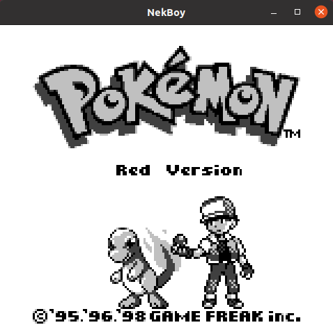

# Nekboy
This is a in development Gameboy (DMG-01) Emulator written in Java, during my free time just for fun/ to learn about the architecture.

## Status
* Almost everything is partially implemented, except Sound.
* Runs Tetris and Dr Mario, it gets stuck on Pokemon Blue after pressing "New Game", only Professor Oak appears and no text.
* Partially implemented MBC3 and external ram in order to play Pokemon Blue. No other MBC Implementation yet.
* Passes almost all CPU Instructions Blarggs test.
* Emulation is a bit slow/CPU heavy, I need to look for ways of making it more efficient.
* Timer and Interrupts are yet not correctly implemented.

## Screenshots

## Resources
I could not have made any progress without the amazing resources out there. This are some I used:
* [Pan Docs](https://gbdev.io/pandocs/)
* [GameBoy Emulation in Javascript](http://imrannazar.com/GameBoy-Emulation-in-JavaScript)
* [Binjgb Emulator](https://github.com/binji/binjgb)
